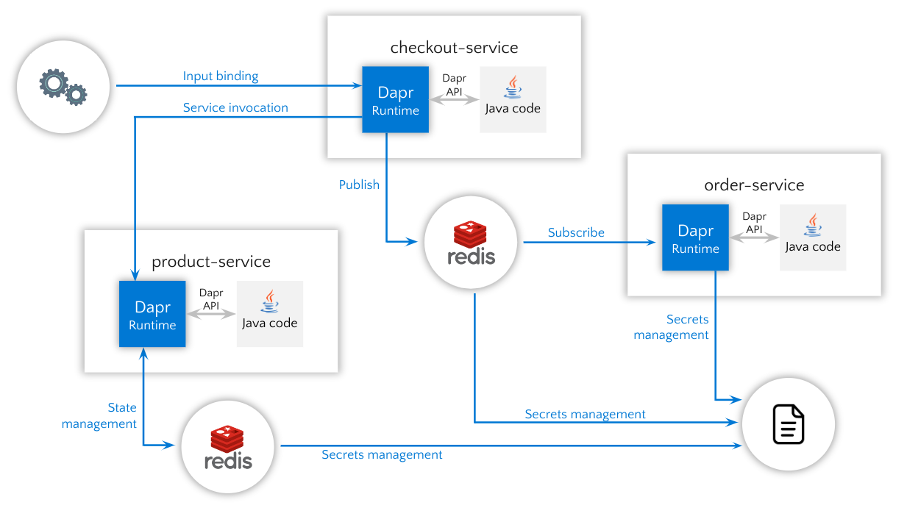
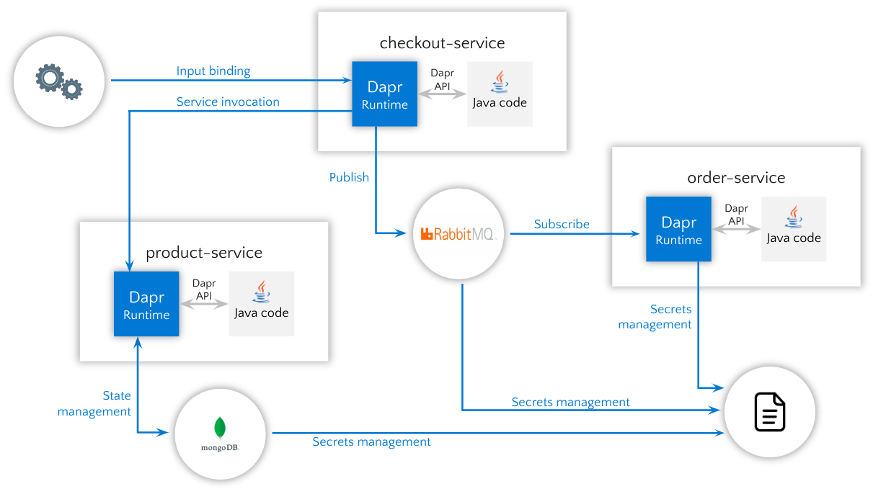

# Dapr PoC
Proof of concept using [Dapr](https://dapr.io/) (Distributed Application Runtime). APIs for building portable and reliable microservices. Any language, any framework, anywhere.

Examples of API building blocks:
- Service invocation
- State management
- Publish and subscribe
- Bindings
- Secrets management
- Observability
- Resiliency

## Requisites

* [Dapr and Dapr Cli](https://docs.dapr.io/getting-started/install-dapr-cli/).
* [Init Dapr locally](https://docs.dapr.io/getting-started/install-dapr-selfhost/).

* Start a MongoDB by entering the following command:

```bash
docker run -d -p 27017:27017 --name dapr_mongo -e MONGO_INITDB_ROOT_USERNAME=mongouser -e MONGO_INITDB_ROOT_PASSWORD=mongopassword mongo:4.4.20
```

* Start a RabbitMQ by entering the following command:

```bash
docker run -d -p 5672:5672 -p 15672:15672 --name dapr_rabbitmq rabbitmq:3-management-alpine
```

## Build services

```bash
cd ./dapr-poc
mvn clean install
```

### Config services with Redis components



Dapr initialization starts Redis container instance to be used as a local state store and message broker.
Services are configured by default to work with Redis.

### Config services with MongoDB and RabbitMQ components



Modify the values of the following properties:

*product-service/src/main/resources/application.yml*
```
dberenguer.dapr.state-store.name: state-mongo
```

*checkout-service/src/main/resources/application.yml*
```
dberenguer.dapr.pub-sub.name: state-rabbitmq
```

*order-service/src/main/resources/application.yml*
```
dberenguer.dapr.pub-sub.name: state-rabbitmq
```

## Run services with Dapr

Follow the instructions in the readme file of each service to run them.

## Observability

To view traces, in your browser go to http://localhost:9411 and you will see the Zipkin UI.
